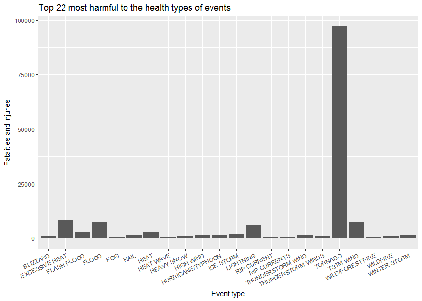
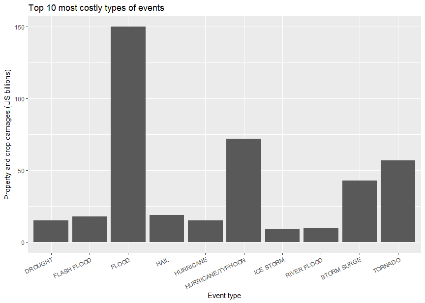

# NOAA severe weather report
Maurício Collaça Ramos  
October, 12, 2017  


# Synopsis

This analysis explores the NOAA Storm Database to figure out the weather events that are the most harmful to the health and to the economy in United States.

The **Data Processing** section of this report is very technical and contains information about the data source, environment used, programming language, data validations and transformations necessary to achieve the answers.  This section also indicates some inconsistencies in the NOAA database that seems not to jeopardize the overall quality of the answers.

The **Results** section of this report contains the actual answers to the questions where one can see tables and plots.

# Data Processing

## Environment used

Hardware:

    Processor: Inter(R) Core(TM) i5-2300 CPU @ 2.80Ghz
    Number of Cores: 4
    Installed RAM: 8.00 GB  
    System type: x64-based processor

Operating System:

```r
Sys.info()[c("sysname","release")]
```

```
##   sysname   release 
## "Windows"  "10 x64"
```

R version:

```r
R.Version()[c("version.string", "arch")]
```

```
## $version.string
## [1] "R version 3.4.2 (2017-09-28)"
## 
## $arch
## [1] "x86_64"
```

Additional R packages installed and loaded.

```r
library(dplyr); library(ggplot2)
```
* dplyr 0.7.4
* ggplot2 2.2.1.

RStudio Desktop version 1.0.136

## Data source

The data source for this report is available at:

* https://d396qusza40orc.cloudfront.net/repdata%2Fdata%2FStormData.csv.bz2.

The data documentation is available at:

* National Weather Service [Storm Data Documentation](https://d396qusza40orc.cloudfront.net/repdata%2Fpeer2_doc%2Fpd01016005curr.pdf)
* National Climatic Data Center Storm Events [FAQ](https://d396qusza40orc.cloudfront.net/repdata%2Fpeer2_doc%2FNCDC%20Storm%20Events-FAQ%20Page.pdf)

## Loading data

The data is automatically downloaded from the site.


```r
dataFile <- "StormData.csv.bz2"
if (!file.exists(dataFile))
    download.file("https://d396qusza40orc.cloudfront.net/repdata%2Fdata%2FStormData.csv.bz2", dataFile, mode = "wb", cacheOK = FALSE, quiet = FALSE)
```

To avoid losing any meaning, the columns are loaded as character data type and further converted to other data types as needend.


```r
if (!exists("StormData"))
    StormData <- read.csv(dataFile, stringsAsFactors = FALSE, colClasses = "character")
```

## Transformations

The columns used to produce this report are:

* `EVTYPE` - the type of the weather phenomena event.
* `STATE` - The US state, district, territory or possession.
* `FATALITIES` - number of fatalities.
* `INJURIES` - number of injuries.
* `PROPDMG` - property damage estimate.
* `PROPDMGEXP` - property damage estimate magnitude.
* `CROPDMG`- crop damage estimate.
* `CROPDMGEXP` - crop damage estimate magnitude.

Selecting and converting columns to appropriate data types. Removing duplicated, leading and trailing whitespaces from the event type to avoid classification breaks:


```r
library(dplyr)
df <- StormData %>%
    select(EVTYPE, STATE, FATALITIES, INJURIES, PROPDMG, PROPDMGEXP, CROPDMG, CROPDMGEXP) %>%
    mutate(EVTYPE = gsub(" +"," ",trimws(EVTYPE)),
           FATALITIES = as.integer(FATALITIES),
           INJURIES = as.integer(INJURIES),
           PROPDMG = as.numeric(PROPDMG),
           CROPDMG = as.numeric(CROPDMG))
str(df)
```

```
## 'data.frame':	902297 obs. of  8 variables:
##  $ EVTYPE    : chr  "TORNADO" "TORNADO" "TORNADO" "TORNADO" ...
##  $ STATE     : chr  "AL" "AL" "AL" "AL" ...
##  $ FATALITIES: int  0 0 0 0 0 0 0 0 1 0 ...
##  $ INJURIES  : int  15 0 2 2 2 6 1 0 14 0 ...
##  $ PROPDMG   : num  25 2.5 25 2.5 2.5 2.5 2.5 2.5 25 25 ...
##  $ PROPDMGEXP: chr  "K" "K" "K" "K" ...
##  $ CROPDMG   : num  0 0 0 0 0 0 0 0 0 0 ...
##  $ CROPDMGEXP: chr  "" "" "" "" ...
```

### Filtering valid States

There are a number of events whose abbreviations are not a valid US state, district, territory or possession.


```r
abbreviations <- c("AK","AL","AR","AS","AZ","CA","CO","CT","DC","DE","FL","FM","GA","GU","HI","IA","ID","IL","IN","KS","KY","LA","MA","MD","ME","MH","MI","MN","MO","MP","MS","MT","NC","ND","NE","NH","NJ","NM","NV","NY","OH","OK","OR","PA","PR","PW","RI","SC","SD","TN","TX","UM","UT","VA","VI","VT","WA","WI","WV","WY")
unique(df$STATE[!df$STATE %in% abbreviations])
```

```
##  [1] "ST" "AM" "LC" "PH" "GM" "PZ" "AN" "LH" "LM" "LE" "LS" "SL" "LO" "PM"
## [15] "PK" "XX"
```

Therefore, their respective events are removed.


```r
df <- df %>% filter(STATE %in% abbreviations)
```

### Checking for missing or invalid values

There are no occurrences of missing values in any column:


```r
sum(is.na(df[,c("EVTYPE", "FATALITIES", "INJURIES", "PROPDMG", "PROPDMGEXP", "CROPDMG", "CROPDMGEXP")]))
```

```
## [1] 0
```

There are no occurrences of invalid negative values:


```r
sum(df[, c("FATALITIES", "INJURIES","PROPDMG", "CROPDMG")] < 0)
```

```
## [1] 0
```

### Normalizing the Property and Crop damage estimate values

From the National Weather Service [Storm Data Documentation](https://d396qusza40orc.cloudfront.net/repdata%2Fpeer2_doc%2Fpd01016005curr.pdf), item 2.7, page 12:

>"Estimates should be rounded to three significant digits, followed by an alphabetical character signifying the magnitude of the number, i.e., 1.55B for $1,550,000,000. Alphabetical characters used to signify magnitude include “K” for thousands, “M” for millions, and “B” for billions."

Before any calculation takes place, the variables `PROPDMG` and `CROPDMG` must be normalized in US dollars unit by magnifying them with respective magnitudes `PROPDMGEXP` and `CROPDMGEXP`. 

Standardizing magnitude symbols in capital letters:


```r
df <- df %>% mutate(PROPDMGEXP = toupper(PROPDMGEXP),
                    CROPDMGEXP = toupper(CROPDMGEXP))
```

There are invalid magnitude symbols in both `PROPDMGEXP` and `CROPDMGEXP`, i.e., characters different from "K", "M", "B" and "".


```r
unique(df$PROPDMGEXP)
```

```
##  [1] "K" "M" ""  "B" "+" "0" "5" "6" "?" "4" "2" "3" "H" "7" "-" "1" "8"
```

```r
unique(df$CROPDMGEXP)
```

```
## [1] ""  "M" "K" "B" "?" "0" "2"
```

Percent of valid property damage estimate magnitude:


```r
validPropDmg <- df$PROPDMGEXP %in% c("K","M","B","")
sprintf("%f%%", sum(validPropDmg)/nrow(df)*100)
```

```
## [1] "99.963833%"
```

Percent of valid crop damage estimate magnitude:


```r
validCropDmg <- df$CROPDMGEXP %in% c("K","M","B","")
sprintf("%f%%", sum(validCropDmg)/nrow(df)*100)
```

```
## [1] "99.996958%"
```

The crop and property damage estimates whose magnitudes are invalid will not be considered for calculation, therefore, they will be replaced with `NA` missing values in order to prevent miscalculations.


```r
df$PROPDMG[!validPropDmg] <- NA
df$PROPDMGEXP[!validPropDmg] <- NA
df$CROPDMG[!validCropDmg] <- NA
df$CROPDMGEXP[!validCropDmg] <- NA
```

Normalizing the quantitative variables `PROPDMG` and `CROPDMG` in US dollars by magnifying them with their respective magnitudes `PROPDMGEXP` and `CROPDMGEXP`.


```r
df$PROPDMG[validPropDmg] <- df$PROPDMG[validPropDmg] *
    (10^((match(df$PROPDMGEXP[validPropDmg], c("","K","M","B"))-1)*3))
df$CROPDMG[validCropDmg] <- df$CROPDMG[validCropDmg] *
    (10^((match(df$CROPDMGEXP[validCropDmg], c("","K","M","B"))-1)*3))
```

As `PROPDMG` and `CROPDMG` are already normalized, their magnitudes symbols are discarded.


```r
df$PROPDMGEXP <- NULL
df$CROPDMGEXP <- NULL
```

### Event types

From the National Weather Service [Storm Data Documentation](https://d396qusza40orc.cloudfront.net/repdata%2Fpeer2_doc%2Fpd01016005curr.pdf), item 2.1, page 5:


>"2.1 Permitted Storm Data Events.  The only events permitted in Storm Data are listed in Table 1 of Section 2.1.1."

There should be only 48 event types as stated above, however, the data set contains many inconsistent event types:


```r
(totalTypes <- length(unique(df$EVTYPE)))
```

```
## [1] 965
```

In an effort to reduce some inconsistency, additional transformations take place:

1. Capitalize all event types, group them by `EVTYPE` and sum their quantitative variables `FATALITIES`, `INJURIES`, `PROPDMG` and `CROPDMG`.
2. Filter event types with at least one fatality, injury or damages to properties or crops.


```r
df <- df %>%
    mutate(EVTYPE = toupper(EVTYPE)) %>%
    group_by(EVTYPE) %>%
    summarise(FATALITIES = sum(FATALITIES, na.rm = TRUE),
              INJURIES = sum(INJURIES, na.rm = TRUE),
              TOTALHITS = FATALITIES + INJURIES,
              PROPDMG = sum(PROPDMG, na.rm = TRUE),
              CROPDMG = sum(CROPDMG, na.rm = TRUE),
              TOTALDMG = PROPDMG + CROPDMG) %>%
    filter(TOTALHITS > 0 | TOTALDMG > 0)%>%
    as.data.frame()
```

The last transformation reduced the inconsistencies from 965 to:


```r
length(unique(df$EVTYPE))
```

```
## [1] 431
```

This is still much greater than the 48 event types specified in the documentation but to reclassify all these event types is a huge work and out of the scope of this report.  Therefore, this analysis will continue as it is.

# Results

## The types of events most harmful to the health

**Across the United States, which types of events (as indicated in the `EVTYPE` variable) are most harmful with respect to population health?**

The criteria is to select 10 events with the biggest sum of `FATALITIES` and `INJURIES` which is already calculated in the variable `TOTALHITS`.


```r
harmful <- df %>% select(EVTYPE, TOTALHITS) %>%
    arrange(desc(TOTALHITS)) %>%
    slice(1:10)
knitr::kable(harmful, col.names = c("Type of event", "Fatalities and injuries"))
```


Type of event        Fatalities and injuries
------------------  ------------------------
TORNADO                                96979
EXCESSIVE HEAT                          8428
TSTM WIND                               7461
FLOOD                                   7259
LIGHTNING                               6046
HEAT                                    3037
FLASH FLOOD                             2755
ICE STORM                               2064
THUNDERSTORM WIND                       1621
WINTER STORM                            1527

Plotting a bar chart of the top 10 most harmful types of events.


```r
ggplot(harmful, aes(x=EVTYPE, y=TOTALHITS)) + geom_col() +
    xlab("Event type") + ylab("Fatalities and injuries") +
    ggtitle(paste0("Top ",nrow(harmful)," most harmful types of events")) +
    theme(axis.text.x = element_text(angle = 25, vjust = 1, hjust=1))
```

<!-- -->

## The most costly types of events

**Across the United States, which types of events have the greatest economic consequences?**

The criteria is to select 10 events with the biggest sum of `PROPDMG` and `CROPDMG` which is already calculated in the variable `TOTALDMG`.

The total damage is scaled to billions of US dollars for easier reading.


```r
costly <- df %>% select(EVTYPE, TOTALDMG) %>%
    mutate(TOTALDMG = round(TOTALDMG / (10^9), 0)) %>%
    arrange(desc(TOTALDMG)) %>%
    slice(1:10)
knitr::kable(costly, col.names = c("Type of event", "Property and crop damages (US billions)"))
```


Type of event        Property and crop damages (US billions)
------------------  ----------------------------------------
FLOOD                                                    150
HURRICANE/TYPHOON                                         72
TORNADO                                                   57
STORM SURGE                                               43
HAIL                                                      19
FLASH FLOOD                                               18
DROUGHT                                                   15
HURRICANE                                                 15
RIVER FLOOD                                               10
ICE STORM                                                  9

Plotting a bar chart of the top 10 most costly types of events.


```r
ggplot(costly, aes(x=EVTYPE, y=TOTALDMG)) + geom_col() +
    xlab("Event type") + ylab("Property and crop damages (US billions)") +
    ggtitle(paste0("Top ",nrow(costly)," most costly types of events")) +
    theme(axis.text.x = element_text(angle = 25, vjust = 1, hjust=1))
```

<!-- -->
