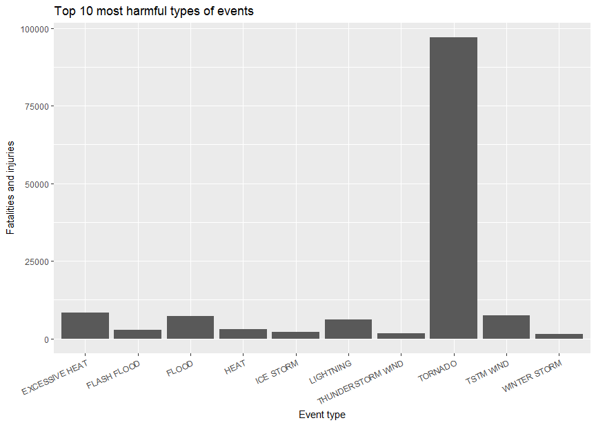

# NOAA severe weather report
Maurício Collaça Ramos  
March, 21, 2017  


# Synopsis

This analysis explores the NOAA Storm Database to figure out the weather events that are the most harmful to the health and to the economy in United States.  These answers are followed by the total number of fatalities, injuries and costs in properties and crops.

The data processing section of this report is very technical and contains information about the data source, environment used, programming language, data validations and transformations necessary to achieve the answers.  This section also indicates some inconsistencies in the NOAA database that seems not to jeopardize the overall quality of the answers.

The result section of this report contains the actual answers to the questions where one can see tables and plots.

# Data Processing

## Environment used

Hardware:

    Processor: Inter(R) Core(TM) i5-2300 CPU @ 2.80Ghz
    Number of Cores: 4
    Installed RAM: 8.00 GB  
    System type: x64-based processor

Operating System:

```r
Sys.info()[c("sysname","release")]
```

```
##   sysname   release 
## "Windows"  "10 x64"
```

R version:

```r
R.Version()[c("version.string", "arch")]
```

```
## $version.string
## [1] "R version 3.3.2 (2016-10-31)"
## 
## $arch
## [1] "x86_64"
```

Additional R packages installed and loaded.

```r
library(dplyr); library(ggplot2)
```
* dplyr 0.5.0
* ggplot2 2.2.1.

RStudio Desktop version 1.0.136

## Data source

The data source for this report is available at:

* https://d396qusza40orc.cloudfront.net/repdata%2Fdata%2FStormData.csv.bz2.

The data documentation is available at:

* National Weather Service [Storm Data Documentation](https://d396qusza40orc.cloudfront.net/repdata%2Fpeer2_doc%2Fpd01016005curr.pdf)
* National Climatic Data Center Storm Events [FAQ](https://d396qusza40orc.cloudfront.net/repdata%2Fpeer2_doc%2FNCDC%20Storm%20Events-FAQ%20Page.pdf)

## Loading data

The data is automatically downloaded from the site.


```r
dataFile <- "StormData.csv.bz2"
if (!file.exists(dataFile))
    download.file("https://d396qusza40orc.cloudfront.net/repdata%2Fdata%2FStormData.csv.bz2", dataFile, mode = "wb", cacheOK = FALSE, quiet = FALSE)
```

To avoid losing any meaning, the columns are loaded as character data type and further converted to other data types as needend.


```r
if (!exists("StormData"))
    StormData <- read.csv(dataFile, stringsAsFactors = FALSE, colClasses = "character")
```

## Transformations

The columns used to produce this report are:

* `EVTYPE` - the type of the weather phenomena event.
* `STATE` - The US state, district, territory or possession.
* `FATALITIES` - number of fatalities.
* `INJURIES` - number of injuries.
* `PROPDMG` - property damage estimate.
* `PROPDMGEXP` - property damage estimate magnitude.
* `CROPDMG`- crop damage estimate.
* `CROPDMGEXP` - crop damage estimate magnitude.

Selecting and converting columns to appropriate data types. Removing duplicated, leading and trailing whitespaces from the event type to avoid classification breaks:


```r
library(dplyr)
df <- StormData %>%
    select(EVTYPE, STATE, FATALITIES, INJURIES, PROPDMG, PROPDMGEXP, CROPDMG, CROPDMGEXP) %>%
    mutate(EVTYPE = gsub(" +"," ",trimws(EVTYPE)),
           FATALITIES = as.integer(FATALITIES),
           INJURIES = as.integer(INJURIES),
           PROPDMG = as.numeric(PROPDMG),
           CROPDMG = as.numeric(CROPDMG))
```

### US States, Districts, Territories and Possessions

There are a number of events whose abbreviations are not a valid US state, district, territory or possession.


```r
abbreviations <- c("AK","AL","AR","AS","AZ","CA","CO","CT","DC","DE","FL","FM","GA","GU","HI","IA","ID","IL","IN","KS","KY","LA","MA","MD","ME","MH","MI","MN","MO","MP","MS","MT","NC","ND","NE","NH","NJ","NM","NV","NY","OH","OK","OR","PA","PR","PW","RI","SC","SD","TN","TX","UM","UT","VA","VI","VT","WA","WI","WV","WY")
unique(df$STATE[!df$STATE %in% abbreviations])
```

```
##  [1] "ST" "AM" "LC" "PH" "GM" "PZ" "AN" "LH" "LM" "LE" "LS" "SL" "LO" "PM"
## [15] "PK" "XX"
```

Therefore, their respective events are removed.


```r
df <- df %>% filter(STATE %in% abbreviations)
```

### Missing and invalid values

There are no occurrences of missing data in these columns:


```r
sum(is.na(df[,c("EVTYPE", "FATALITIES", "INJURIES", "PROPDMG", "PROPDMGEXP", "CROPDMG", "CROPDMGEXP")]))
```

```
## [1] 0
```

The are no occurences of negative values:


```r
sum(df[, c("FATALITIES", "INJURIES","PROPDMG", "CROPDMG")] < 0)
```

```
## [1] 0
```

### Property and crop damage estimates

According to the documentation:

_"Estimates should be rounded to three significant digits, followed by an alphabetical character signifying the magnitude of the number, i.e., 1.55B for $1,550,000,000. Alphabetical characters used to signify magnitude include “K” for thousands, “M” for millions, and “B” for billions."_

Magnitudes found for property damage estimates:


```r
unique(df$PROPDMGEXP)
```

```
##  [1] "K" "M" ""  "B" "m" "+" "0" "5" "6" "?" "4" "2" "3" "h" "7" "H" "-"
## [18] "1" "8"
```

Magnitudes found for crop damage estimates:


```r
unique(df$CROPDMGEXP)
```

```
## [1] ""  "M" "K" "m" "B" "?" "0" "k" "2"
```

Standardizing magnitudes in capital letters:


```r
df <- df %>% mutate(PROPDMGEXP = toupper(PROPDMGEXP), CROPDMGEXP = toupper(CROPDMGEXP))
```

Number of property damage estimates with invalid magnitudes:


```r
invalidPropDmg <- df$PROPDMG > 0 & !df$PROPDMGEXP %in% c("K","M","B")
sum(invalidPropDmg)
```

```
## [1] 327
```

Proportion of invalid property damage estimates in relation to the valid property damage estimates:


```r
validPropDmg <- df$PROPDMG > 0 & df$PROPDMGEXP %in% c("K","M","B")
sprintf("%1.2f%%", sum(invalidPropDmg)/sum(validPropDmg)*100)
```

```
## [1] "0.14%"
```

Number of crop damage estimates with invalid magnitudes:


```r
invalidCropDmg <- df$CROPDMG > 0 & !df$CROPDMGEXP %in% c("K","M","B")
sum(invalidCropDmg)
```

```
## [1] 15
```

Proportion of invalid crop damage estimates in relation to the valid crop damage estimates:


```r
validCropDmg <- df$CROPDMG > 0 & df$CROPDMGEXP %in% c("K","M","B")
sprintf("%1.2f%%", sum(invalidCropDmg)/sum(validCropDmg)*100)
```

```
## [1] "0.07%"
```

These invalid crop and property damage estimates will not be considered when calculating economic consequences, therefore, they will be replace with `NA` missing values in order to prevent miscalculations.


```r
df$PROPDMG[invalidPropDmg] <- NA
df$PROPDMGEXP[invalidPropDmg] <- NA
df$CROPDMG[invalidCropDmg] <- NA
df$CROPDMGEXP[invalidCropDmg] <- NA
```

Normalizing the quantitative variables `PROPDMG` and `CROPDMG` in US dollars by magnifying them with their respective magnitudes `PROPDMGEXP` and `CROPDMGEXP`.


```r
df$PROPDMG[validPropDmg] <-
    df$PROPDMG[validPropDmg] * (10^(match(df$PROPDMGEXP[validPropDmg], c("K","M","B"))*3))
df$CROPDMG[validCropDmg] <-
    df$CROPDMG[validCropDmg] * (10^(match(df$CROPDMGEXP[validCropDmg], c("K","M","B"))*3))
df$PROPDMGEXP <- NULL
df$CROPDMGEXP <- NULL
```

### Event types

According to the documentation:

_"2.1 Permitted Storm Data Events.  The only events permitted in Storm Data are listed in Table 1 of Section 2.1.1."_

There should be only 48 event types as listed above, however, the data set contains many inconsistent event types:


```r
(totalTypes <- length(unique(df$EVTYPE)))
```

```
## [1] 965
```

In order to reduce some inconsistency, additional transformations take place:

1. Capitalize all event types and group them aggregating their quantitative variables `FATALITIES`, `INJURIES`, `PROPDMG` and `CROPDMG`.
2. Filter event types with fatalities, injuries or damages to properties and crops.


```r
df <- df %>%
    mutate(EVTYPE = toupper(EVTYPE)) %>%
    group_by(EVTYPE) %>%
    summarise(FATALITIES = sum(FATALITIES, na.rm = TRUE),
              INJURIES = sum(INJURIES, na.rm = TRUE),
              TOTALHITS = FATALITIES + INJURIES,
              PROPDMG = sum(PROPDMG, na.rm = TRUE),
              CROPDMG = sum(CROPDMG, na.rm = TRUE),
              TOTALLOSSES = PROPDMG + CROPDMG) %>%
    filter(TOTALHITS > 0 | TOTALLOSSES > 0)%>%
    as.data.frame()
```

The last transformation reduced the inconsistencies from 965 to:


```r
length(unique(df$EVTYPE))
```

```
## [1] 430
```

This is still much greater than the specified in the documentation but to reclassify all these event types is a huge work and out of the scope of this report.

# Results

## The types of events most harmful to the health

**Across the United States, which types of events (as indicated in the `EVTYPE` variable) are most harmful with respect to population health?**

The criteria used to pick the the events that are most harmful to the health is the sample quantile corresponding to 95% probablity.


```r
harmful <- df %>% select(EVTYPE, TOTALHITS) %>%
    filter(TOTALHITS >= quantile(TOTALHITS, 0.95)) %>%
    arrange(desc(TOTALHITS))
knitr::kable(harmful, col.names = c("Type of event", "Fatalities and injuries"))
```


Type of event         Fatalities and injuries
-------------------  ------------------------
TORNADO                                 96979
EXCESSIVE HEAT                           8428
TSTM WIND                                7461
FLOOD                                    7259
LIGHTNING                                6046
HEAT                                     3037
FLASH FLOOD                              2755
ICE STORM                                2064
THUNDERSTORM WIND                        1621
WINTER STORM                             1527
HIGH WIND                                1385
HAIL                                     1376
HURRICANE/TYPHOON                        1339
HEAVY SNOW                               1148
WILDFIRE                                  986
THUNDERSTORM WINDS                        982
BLIZZARD                                  906
FOG                                       796
RIP CURRENT                               600
WILD/FOREST FIRE                          557
HEAT WAVE                                 551
RIP CURRENTS                              501

Plotting a bar chart of the top 22 most harmful types of events.


```r
ggplot(harmful, aes(x=EVTYPE, y=TOTALHITS)) + geom_col() +
    xlab("Event type") + ylab("Fatalities and injuries") +
    ggtitle(paste0("Top ",nrow(harmful)," most harmful to the health types of events")) +
    theme(axis.text.x = element_text(angle = 25, vjust = 1, hjust=1))
```

<!-- -->

## The most costly types of events

**Across the United States, which types of events have the greatest economic consequences?**

The criteria used to pick the most costly events is the sample quantile corresponding to 95% probablity.  The total property and crop damages are scaled to billions of US dollars for easier reading.


```r
costly <- df %>% select(EVTYPE, TOTALLOSSES) %>%
    mutate(TOTALLOSSES = round(TOTALLOSSES / (10^9), 3)) %>%
    filter(TOTALLOSSES >= quantile(TOTALLOSSES, 0.95)) %>%
    arrange(desc(TOTALLOSSES))
knitr::kable(costly, col.names = c("Type of event", "Property and crop damages (US billions)"))
```


Type of event                 Property and crop damages (US billions)
---------------------------  ----------------------------------------
FLOOD                                                         150.320
HURRICANE/TYPHOON                                              71.914
TORNADO                                                        57.352
STORM SURGE                                                    43.324
HAIL                                                           18.758
FLASH FLOOD                                                    17.562
DROUGHT                                                        15.019
HURRICANE                                                      14.610
RIVER FLOOD                                                    10.148
ICE STORM                                                       8.967
TROPICAL STORM                                                  8.382
WINTER STORM                                                    6.715
HIGH WIND                                                       5.909
WILDFIRE                                                        5.061
TSTM WIND                                                       5.047
STORM SURGE/TIDE                                                4.642
THUNDERSTORM WIND                                               3.898
HURRICANE OPAL                                                  3.192
WILD/FOREST FIRE                                                3.109
HEAVY RAIN/SEVERE WEATHER                                       2.500
THUNDERSTORM WINDS                                              1.927
TORNADOES, TSTM WIND, HAIL                                      1.602

Plotting a bar chart of the top 22 most costly types of events.


```r
ggplot(costly, aes(x=EVTYPE, y=TOTALLOSSES)) + geom_col() +
    xlab("Event type") + ylab("Property and crop damages (US billions)") +
    ggtitle(paste0("Top ",nrow(costly)," most costly types of events")) +
    theme(axis.text.x = element_text(angle = 25, vjust = 1, hjust=1))
```

<!-- -->
